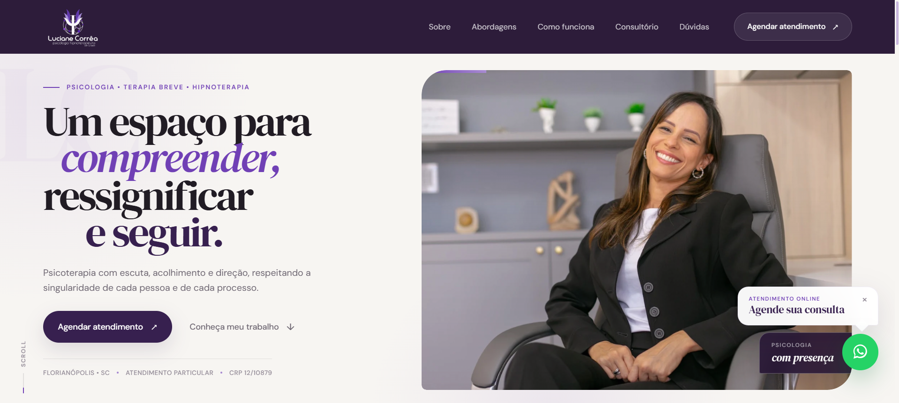

# Landing Page — Luciane Corrêa | Psicóloga e Hipnoterapeuta

[](https://assisfilipee.github.io/psicologa-luciane-correa/)

<p align="center">
  <a href="https://assisfilipee.github.io/psicologa-luciane-correa/">
    <strong>→ Visualizar projeto online</strong>
  </a>
</p>

---

## Sobre o projeto

Landing page desenvolvida para **Luciane Corrêa — Psicóloga e Hipnoterapeuta**, com foco em transmitir acolhimento, profissionalismo e confiança através de uma experiência visual elegante e responsiva.

O projeto foi construído do zero com atenção especial à hierarquia de informações, experiência do usuário, performance e adaptação para diferentes tamanhos de tela.

---

## Principais características

- Design responsivo para desktop, tablet e mobile
- Layout editorial e visual premium
- Navegação por âncoras entre as seções
- Menu hambúrguer para dispositivos móveis e tablets
- Animações de entrada durante a navegação
- Seções interativas com tabs e painéis
- Timeline do processo terapêutico
- FAQ em formato accordion
- Botão flutuante de WhatsApp
- CTA estratégico para agendamento
- Imagens otimizadas em WebP
- Estrutura preparada para SEO
- `robots.txt`
- `sitemap.xml`
- Favicon personalizado
- Publicação via GitHub Pages

---

## Responsividade

O projeto foi desenvolvido e ajustado para três grupos principais de dispositivos:

| Dispositivo | Breakpoint |
|---|---|
| Mobile / iPhone | até `480px` |
| Tablet / iPad | `481px` até `1024px` |
| Desktop / Laptop | acima de `1024px` |

A versão desktop foi utilizada como referência visual para preservar a mesma identidade e experiência nas versões mobile e tablet.

---

## Seções do site

O projeto conta com:

- Hero principal
- Faixa de autoridade
- Acolhimento e identificação
- Abordagens terapêuticas
- Primeiro encontro
- Sobre Luciane
- Processo terapêutico
- Consultório
- Perguntas frequentes
- Contato e CTA final
- Footer institucional

---

## Tecnologias utilizadas

- HTML5
- CSS3
- JavaScript
- CSS Grid
- Flexbox
- Media Queries
- Intersection Observer
- Git
- GitHub
- GitHub Pages

Nenhum framework CSS ou JavaScript foi utilizado no desenvolvimento do projeto.

---

## Estrutura do projeto

```text
psicologa-luciane-correa/
│
├── assets/
│   ├── css/
│   │   ├── header.css
│   │   ├── hero.css
│   │   ├── responsive.css
│   │   ├── section.css
│   │   └── style.css
│   │
│   ├── img/
│   │   ├── consultorio.webp
│   │   ├── logo.png
│   │   ├── luciane-certificados.jpg
│   │   ├── luciane-certificados.webp
│   │   ├── luciane-home.webp
│   │   ├── luciane-perfil.webp
│   │   └── preview.png
│   │
│   └── js/
│       ├── animation.js
│       └── main.js
│
├── favicon.ico
├── index.html
├── README.md
├── robots.txt
└── sitemap.xml
```

---

## Performance e experiência

Durante o desenvolvimento foram adotadas práticas como:

- Uso de imagens em formato WebP
- CSS separado por responsabilidade
- Arquivo exclusivo para responsividade
- Animações suaves e não invasivas
- Suporte a `prefers-reduced-motion`
- Áreas clicáveis adaptadas para dispositivos touch
- Controle de overflow horizontal
- Navegação otimizada para telas menores
- Uso de elementos semânticos no HTML

---

## Acessibilidade

O projeto também contempla cuidados de acessibilidade, incluindo:

- Estados de foco visíveis
- Uso de atributos ARIA
- Textos alternativos em imagens
- Menu mobile com estado expandido
- Suporte à redução de movimento do sistema
- Contraste visual adequado entre elementos

---

## Deploy

O projeto está hospedado através do **GitHub Pages**.

### Acesse o site

https://assisfilipee.github.io/psicologa-luciane-correa/

---

## Autor

Desenvolvido por **Filipe Assis**.

Desenvolvimento Front-end, Landing Pages, Sites Institucionais e experiências digitais responsivas.

[www.filipeassis.dev](https://www.filipeassis.dev)

---

<p align="center">
  <strong>Filipe Assis — Desenvolvimento Web</strong>
</p>
